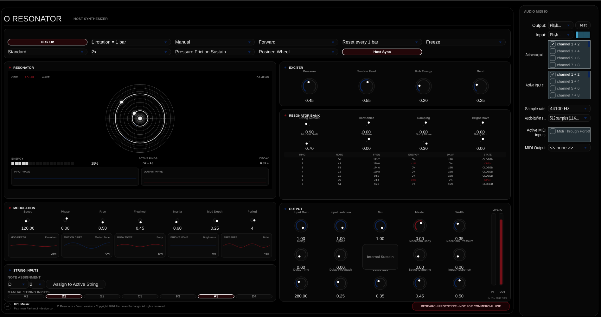

<div align="center">

**Official Website**

https://iusmusic.com/

**GitHub Release**

https://github.com/IUSmusic/O-Resonator-Synthesizer/releases/tag/v1.0.0

# O Resonator

**A rotating seven-ring string body for sustained resonance, flywheel motion, and external audio transformation**  
*Research demo - Seven concentric string rings - Standalone instrument - Effect processor - VST3*


</div>

---

<div align="center">

### Download Demo Version

| Platform | Standalone | VST3 Plugin |
|----------|------------|-------------|
| **Windows 64-bit** | [Download from v1.0.0 release](https://github.com/IUSmusic/O-Resonator-Synthesizer/releases/tag/v1.0.0) | [Download from v1.0.0 release](https://github.com/IUSmusic/O-Resonator-Synthesizer/releases/tag/v1.0.0) |
| **Linux 64-bit** | [Download from v1.0.0 release](https://github.com/IUSmusic/O-Resonator-Synthesizer/releases/tag/v1.0.0) | [Download from v1.0.0 release](https://github.com/IUSmusic/O-Resonator-Synthesizer/releases/tag/v1.0.0) |

</div>

---

<div align="center">



</div>

---

# O Resonator

**O Resonator** is a JUCE-based rotating string-body instrument and audio processor. It is built around a black circular disk containing **seven internal concentric string rings**. Each ring has an electronic activation path. When a ring is active, its path opens and it contributes to one shared rotating resonant body.

O Resonator does **not** work like a normal note-triggered synth, arpeggiator, sequencer, plucked string, or step-based effect. The flywheel does not strike, pluck, or trigger the strings. Instead, it continuously shapes the active string paths through motion, pressure, damping, brightness, inertia, and body resonance.

In simple terms:

```text
active string path → sustained string resonance → flywheel modulation → body output
```

The result is a sound that **blooms rather than strikes**. It can become a low dark drone, a shifting harmonic field, a textural resonant body, or an external-audio processor that revoices incoming sound through selected circular string paths.

## Core concept

O Resonator is based on a different model of sound behaviour:

```text
energy enters a rotating circular body
instead of notes being triggered one by one
```

Most instruments begin with a clear event:

```text
press key → note starts
strike string → transient
sequencer step → next note
```

O Resonator begins with activation and continuous motion:

```text
open string path → energy enters ring → flywheel shapes resonance over time
```

This makes the instrument feel less like a fixed patch and more like a resonant object being brought to life.

## The seven string rings

The instrument contains seven tuned internal rings:

```text
A1  D2  G2  C3  F3  A3  D4
```

The visual order from outer ring to inner ring is:

```text
D4
A3
F3
C3
G2
D2
A1
```

Each ring can be opened or closed. Open rings contribute to the harmonic body. Closed rings remain silent.

Changing which rings are active changes the tonal centre and physical weight of the sound:

- **A1 / D2** for low, dark resonance
- **G2 / C3** for central body tone
- **F3 / A3 / D4** for upper shimmer and harmonic lift
- multiple rings together for stacked sustained harmonies

## What makes it different

### 1. Seven-ring harmonic body

The seven concentric strings are not decorative. They define the harmonic structure of the instrument. Activating different rings changes the body of the sound, almost like choosing which strings inside a circular instrument are allowed to vibrate.

### 2. Shared flywheel motion

Movement comes from a shared flywheel, not from an LFO grid, arpeggiator, gate, or step sequencer. The flywheel shapes pressure, damping, brightness, phase, and energy continuously. The movement feels circular, physical, and alive rather than stepped or looped.

### 3. Blooming resonance

O Resonator is designed for sustained resonance. The sound rises, opens, and evolves. It does not rely on sharp plucks or note attacks. This makes it especially suited to drones, ambient work, sound design, cinematic textures, experimental composition, and long-form harmonic motion.

### 4. Instrument and processor

O Resonator can generate its own sustained tone, but it can also process external audio. A voice, guitar, synth, drum loop, field recording, or noise source can be passed through the same seven-ring body and animated by the flywheel.

### 5. Harmonic and textural at once

O Resonator sits between instrument, resonator, and sound processor. It is pitched enough to form harmony, physical enough to feel like a resonant body, and open enough to reshape incoming sound.

## Main features

### 1. Seven-ring resonator engine

The core engine is built around seven parallel resonant string paths:

- A1
- D2
- G2
- C3
- F3
- A3
- D4

Each ring has a smooth electronic activation path. Activating a ring opens it into the rotating body. Deactivating a ring closes that path and lets it fade or damp away.

Multiple active rings sound together as one body. They are not played in sequence.

### 2. Flywheel motion system

The flywheel is the movement source of the instrument. It continuously shapes active rings instead of triggering notes.

Relevant controls include:

- Disk On
- Speed / BPM
- Host Sync
- Phase
- Direction
- Rise
- Flywheel
- Inertia
- Mod Depth
- Period
- Evolution

The flywheel can create slow bloom, drifting movement, circular energy, phase movement, and long-form resonance evolution.

### 3. String activation and resonance controls

The string controls shape how the active rings respond.

Main controls include:

- Pressure
- Sustain Feed
- Rub Energy
- Bend
- String Sustain
- Harmonics
- Damping
- Bright Move
- Input Response

These controls affect the strength, sustain, brightness, harmonic emphasis, damping, bend/tension behaviour, and response of the resonant paths.

### 4. Body, motion, and texture controls

The body controls shape the sound after the active rings enter the shared resonant system.

Main controls include:

- Motion Drift
- Texture
- Body Move
- Body Grit
- Width

These controls help move the instrument from clean sustained resonance into more animated, textured, spatial, or rougher sound design.

### 5. External input processing

O Resonator can be used as an effect processor. In effect mode, incoming audio is routed through the active string paths.

The basic effect model is:

```text
host input
→ input gain
→ active string paths
→ tuned resonant rings
→ flywheel modulation
→ body output
→ mix / master
```

Relevant controls include:

- Input Gain
- Input Isolation
- Mix
- Sidechain Body
- Sidechain Pressure
- Internal Sustain

In this mode, external sound is not simply filtered. It is revoiced through whichever circular strings are active.

### 6. Responsive visual interface

The interface follows the internal state of the instrument while it plays.

Visual components include:

- central disk visualiser
- active ring indication
- resonator bank
- input waveform monitor
- output waveform monitor
- live IO meter
- modulation cards
- motion and energy feedback

The visualiser is intended to make the instrument easier to understand during performance: which rings are active, how the body is moving, and how the signal is entering and leaving the system.

### 7. Resonator bank

The resonator bank shows the seven rings in visual order:

```text
D4
A3
F3
C3
G2
D2
A1
```

The table displays:

- ring number
- note
- frequency
- energy / level
- damping
- state

When rings are opened or closed, the state changes. When notes are assigned or retuned, the note and frequency update.

### 8. Standalone and VST3

O Resonator is designed to run as both:

- a standalone application
- a VST3 plug-in

Standalone mode is useful when O Resonator is used as a self-contained instrument. VST3 mode is useful inside a DAW as either an instrument-style source or an effect processor for other tracks.

## How the sound works

### Active ring

An active ring means:

```text
input path open
ring contributes to the resonant body
flywheel shapes the ring continuously
```

Activation should feel like a smooth tonal arrival, not a pluck.

### Inactive ring

An inactive ring means:

```text
input path closed
no sound from that ring
no hidden note
no automatic trigger
```

MIDI or rotation should not make a closed ring audible by itself.

### Multiple active rings

Multiple active rings form one combined body:

```text
D2 + A3 active
→ sustained D/A rotating drone
```

The rings are not played one after another. They merge into a sustained harmonic field.

## Using O Resonator

### Basic standalone use

1. Open O Resonator as a standalone app or instrument.
2. Activate one or more string rings.
3. Turn **Disk On**.
4. Raise **Sustain Feed** and **Pressure** until the sound blooms.
5. Adjust **Flywheel** and **Inertia** to shape motion.
6. Use **Damping**, **String Sustain**, and **Body Move** to refine the tone.
7. Set **Master** to a safe output level.

Recommended starting rings:

```text
D2 + A3
```

This gives a stable low drone and demonstrates the core sound identity.

### Basic effect use

1. Insert O Resonator as an audio effect on a track.
2. Send audio into the plug-in.
3. Activate one or more rings.
4. Raise **Input Gain**.
5. Increase **Input Isolation** if the signal should be strongly routed through the rings.
6. Adjust **Pressure**, **Sustain Feed**, **Flywheel**, and **Damping**.
7. Use **Mix** and **Master** to balance the processed output.

Good input sources include:

- voice
- guitar
- synth
- drum loop
- field recording
- noise
- sustained pad
- percussion

## Recommended starting settings

### Dark rotating drone

```text
Active strings: D2 + A3
Disk On: enabled
Speed: low to medium
Flywheel: medium
Inertia: medium-high
Sustain Feed: medium
Pressure: low-medium
String Sustain: high
Damping: medium
Motion Drift: low
Texture: low or off
Body Move: medium
Delay: off or low
Space: off or low
Master: safe level
```

### Evolving harmonic field

```text
Active strings: D2 + F3 + A3
Disk On: enabled
Evolution: slow movement
Mod Depth: medium
Period: several rotations
Flywheel: medium-high
Inertia: high
Pressure: medium
Damping: low-medium
Body Move: medium-high
Width: moderate
Space: low
```

### External audio transformation

```text
Mode: effect
Input: voice, synth, guitar, drums, or field recording
Active strings: choose 1–3 rings
Input Gain: raise until input is visible
Input Isolation: medium-high
Internal Sustain: off unless internal tone is desired
Mix: adjust wet/dry balance
Flywheel: medium
Pressure: medium
Damping: medium
Master: safe level
```

## MIDI behaviour

MIDI can be used to retune or shape active strings.

MIDI may:

- retune active string paths
- finger active paths
- bend active paths
- affect pressure or brightness when mapped

MIDI should not:

- auto-arm inactive strings
- trigger plucks
- create arpeggios
- create string-order melodies
- create sound from closed paths

If a string is inactive, MIDI should not make it audible by itself.

## Interface overview

### Welcome notice

On launch, O Resonator may show a rights and use notice before entering the main interface. This confirms the research/demo status and permitted use conditions.

### Main disk

The main disk shows the instrument as a circular resonant body. Active rings are visually emphasised. Motion is shown as energy moving around the ring body. The moving energy mark is not a trigger point; it represents flywheel motion and energy.

### Resonator bank

The resonator bank gives a practical view of the seven rings, including their notes, frequency, energy, damping, and open/closed state.

### Modulation cards

The modulation cards summarise key movement parameters:

- Mod Depth
- Motion Drift
- Body Move
- Bright Move
- Pressure

### Waveform monitors

The waveform lanes show input and output activity so the user can see how much signal is entering the system and how much processed sound is leaving it.

### Output section

The output section controls final level, mix, width, delay, space, and master output behaviour.

## Main control groups

### Resonator / motion

Controls disk movement and flywheel behaviour:

- Disk On
- Host Sync
- Time Mapping
- Direction
- Reset
- Evolution
- Quality
- Oversampling
- Speed
- Phase
- Rise
- Flywheel
- Inertia
- Mod Depth
- Period

### String inputs

Controls the ring activation paths and string response:

- string activation buttons
- note assignment
- Pressure
- Sustain Feed
- Rub Energy
- Bend
- String Sustain
- Harmonics
- Damping
- Input Response

### Exciter and body

Controls how energy enters and colours the body:

- Bright Move
- Motion Drift
- Texture
- Body Move
- Body Grit
- Input Gain
- Input Isolation
- Sidechain Body
- Sidechain Pressure
- Internal Sustain

### Output

Controls final processing and monitoring:

- Mix
- Master
- Width
- Delay
- Space
- live IO meter
- input waveform
- output waveform

## Technical overview

- **Framework:** JUCE
- **Language:** C++17
- **Formats:** Standalone, VST3
- **Core model:** seven concentric tuned string rings
- **Sound behaviour:** continuous activation, sustained resonance, flywheel modulation
- **Use modes:** internal instrument, external audio processor
- **Interface:** custom JUCE UI with circular disk visualisation and waveform monitoring

## Current workflow in practice

A typical session looks like this:

1. Open O Resonator.
2. Activate one or more rings.
3. Start the disk.
4. Raise Sustain Feed and Pressure until the body blooms.
5. Shape motion with Flywheel, Inertia, Speed, Direction, and Evolution.
6. Refine sustain, brightness, damping, body, width, and texture.
7. Use external input if working in effect mode.
8. Monitor the resonator bank, disk visualiser, waveform lanes, and output meter.
9. Save the host project or preset state through the plug-in host.

## Project status

O Resonator is currently provided as a **research demo** and is **not for sale**.

This repository is intended for:

- study
- technical explanation
- private non-commercial evaluation
- teaching
- research discussion
- demonstration of the O Resonator sound model

It is not intended as an open-source commercial product or a permissively licensed software project.

## License

This repository is provided under the **I/US O Resonator Research Demo License 1.0**.

See `LICENSE.md` for the full license text and usage terms.

In plain language:

- You may view, clone, build, and privately study the project for non-commercial research or education.
- You may not sell it, distribute builds, reuse the brand, create derivative products, train AI on it, or treat it as open source.
- All rights remain reserved.

## Rights and trademark notice

IUS (PRS: IUS) and **I/US Music®** identify the performing name and brand for works released under the I/US Music® brand.

**I/US Music®** is a UK registered trademark, No. **UK00004243563**.  
**ISNI:** 0000 0005 2827 1416.

Copyright © Pezhman Farhangi 2026. All rights reserved.

All website content, software content, source code, object code, binaries, plug-ins, standalone applications, audio concepts, sound design logic, interface design, images, official logos, documentation, text, diagrams, product names, design language, music, visual materials, and associated intellectual property are the intellectual property of Pezhman Farhangi and/or I/US Music®, unless expressly stated otherwise in writing.

</div>
